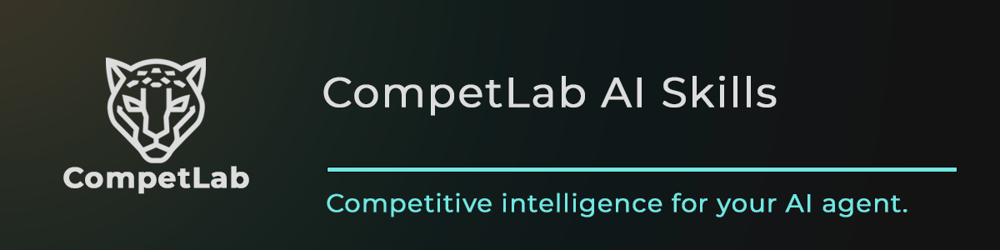

<p align="center">
  
</p>

# CompetLab AI Skills

[](https://agentskills.io)
[](#skills)
[](https://opensource.org/licenses/MIT)
[](#cross-agent-compatibility)

> Turn competitive monitoring data into executive-ready intelligence — automatically.

These skills give your AI agent a competitive intelligence analyst's toolkit: landscape analysis, competitor dossiers, AI visibility reports, on-demand briefings, sales battlecards — plus 7 forward-indicator skills (status/funding/hiring/agent adoption/product velocity/customer voice/ai-ecosystem) and an orchestrator that composes a complete CMO report from the whole suite. All powered by real monitoring data from [CompetLab](https://competlab.com)'s 5 dimensions.

**v2.0 — Leading + Lagging Indicators.** The original 5 skills covered lagging indicators (what's already visible in monitoring data). The 8 new skills are 7 leading-indicator skills plus an orchestrator: the leading indicators surface what your competitors are about to do (funding rounds before press cycles, hiring patterns before product launches, MCP server presence before category-wide agent adoption), and the orchestrator combines all 13 into a single one-command CMO report.

## Install

```bash
npx skills add competlab/competlab-ci-skills --all
```

Or install individual skills:

```bash
npx skills add competlab/competlab-ci-skills --skill competlab-ai-visibility
```

## Skills

### Orchestrator (1)

| Skill | What It Does | Say This |
|-------|-------------|----------|
| **[competlab-cmo-report](skills/competlab-cmo-report/)** | Complete CMO report — sequences all sub-skills + dashboards into 1 main report + 12 dimension docs + 3-5 competitor deep-dives | _"CMO report for [project]"_ / _"Itrinity briefing"_ |

### Lagging-indicator skills (5 — the original set, also runnable standalone)

| Skill | What It Does | Say This |
|-------|-------------|----------|
| **[competlab-ai-visibility](skills/competlab-ai-visibility/)** | How AI models mention and recommend your brand vs competitors | _"AI visibility report"_ |
| **[competlab-weekly-briefing](skills/competlab-weekly-briefing/)** | On-demand CI delta briefing — what changed, what it means, what to do (run it whenever you want a pulse; many teams run it weekly) | _"Weekly competitive update"_ |
| **[competlab-competitor-dive](skills/competlab-competitor-dive/)** | Full competitor dossier with SWOT from 5 dimensions + web research | _"Deep dive on [competitor]"_ |
| **[competlab-battlecard](skills/competlab-battlecard/)** | Sales-ready battlecards with objection handling | _"Battlecard vs [competitor]"_ |
| **[competlab-landscape](skills/competlab-landscape/)** | Full landscape — market dynamics, matrices, strategic recommendations | _"Competitive landscape review"_ |

### Leading-indicator skills (7 NEW — surfaces what competitors are about to do)

| Skill | What It Does | Say This |
|-------|-------------|----------|
| **[competlab-status-watch](skills/competlab-status-watch/)** | Probes competitor status pages — outages, incidents, reliability posture, transparency gaps (sales-ready evidence) | _"Competitor reliability"_ |
| **[competlab-funding-watch](skills/competlab-funding-watch/)** | Funding events, ownership changes, ARR estimates, M&A activity, exec transitions, category-adjacent capital pressure | _"Funding posture for [project]"_ |
| **[competlab-ai-ecosystem](skills/competlab-ai-ecosystem/)** | External developer-ecosystem signals — GitHub orgs, npm/PyPI volumes, community MCP servers, marketplace presence | _"Developer adoption"_ |
| **[competlab-hiring-signals](skills/competlab-hiring-signals/)** | Hiring + GTM-motion via ATS APIs (Ashby/Greenhouse/Lever/Workable) + LinkedIn + exec transitions | _"Competitor hiring"_ |
| **[competlab-agent-adoption](skills/competlab-agent-adoption/)** | First-party MCP server + llms.txt + Schema.org agent adoption verification via JSON-RPC POST (no false positives) | _"Agent-adoption posture"_ |
| **[competlab-product-watch](skills/competlab-product-watch/)** | Snapshots competitor changelogs, GitHub Releases, named-asset directories, MCP marketplaces, API doc versions | _"What did competitors ship recently"_ |
| **[competlab-customer-voice-snapshot](skills/competlab-customer-voice-snapshot/)** | G2/Capterra/Trustpilot snapshots + Reddit/HN recovery for developer-tool categories | _"Customer voice for [competitor]"_ |

### Companion docs (load-bearing for orchestrator + sub-skills)

The orchestrator reads 6 companion docs at start. Sub-skills consuming Perplexity output also reference URL Verification pattern.

- **`PATTERN-url-verification.md`** — URL Verification discipline + MCP JSON-RPC POST sub-pattern + categorical-zero discovery-vs-capability carve-out
- **`KNOWLEDGE-platform-mechanics-and-failures.md`** — how each CompetLab dimension works, failure modes, cross-dim cascade map, vendor-discontinuation detection pattern, scan-failure-as-customer-facing-signal framing
- **`TEMPLATE-briefing.md`** / **`TEMPLATE-dim-doc.md`** / **`TEMPLATE-comp-doc.md`** — L3 briefing + L2 dim doc + L2 competitor deep-dive structures (including lite-comp variant + cross-dim convergence-paragraph pattern)
- **`SKILLS-INDEX.md`** — full skill index + install paths + cross-skill improvements

All companion docs live in `skills/` root alongside the 13 skill folders, so a single `cp -r skills/. .claude/skills/` install grabs everything in one command.

## How It Works

Each skill combines three intelligence layers:

1. **CompetLab data** — structured monitoring across 5 dimensions (AI Visibility, Tech & Trust, Content, Positioning, Pricing)
2. **Live web research** — recent news, reviews, funding, social sentiment, market trends
3. **CI expertise** — SWOT analysis, competitive matrices, positioning maps, cross-dimensional pattern recognition

The skills are the analyst. CompetLab is their data infrastructure.

## What is CompetLab?

Competitive intelligence for the AI era. One platform, 5 dimensions, monitored automatically:

| Dimension | What It Tracks |
|-----------|---------------|
| **AI Visibility** | How ChatGPT, Claude, and Gemini mention and recommend your brand vs competitors (AI Visibility Score 0-100) |
| **Tech & Trust** | Tech stacks, security headers (grade A-F), trust signals, robots.txt AI bot blocking |
| **Content** | Sitemap analysis, content categories, publishing cadence, content gaps |
| **Positioning** | Homepage messaging, value props, CTAs, target audience, differentiators |
| **Pricing** | Plans, billing models, free tiers, enterprise pricing, gap analysis |

AI Visibility tracks how ChatGPT, Claude, and Gemini mention and recommend brands in real time.

> [Start free trial](https://app.competlab.com/register) (14 days, no credit card) | [Learn more](https://competlab.com)

## Installation Options

### Via Skills CLI (recommended)

```bash
# All skills
npx skills add competlab/competlab-ci-skills --all

# Single skill
npx skills add competlab/competlab-ci-skills --skill competlab-weekly-briefing

# Global (available in all projects)
npx skills add competlab/competlab-ci-skills --all -g
```

### Via Claude Code Plugin Marketplace

If you use Claude Code (v1.0.33+), you can install via the native plugin system:

```
/plugin marketplace add competlab/competlab-ci-skills
/plugin install competlab-ci-skills@competlab-ci-skills
```

### Manual (simplest — all 13 skills + 6 companion docs in one command)

```bash
git clone https://github.com/competlab/competlab-ci-skills.git
mkdir -p .claude/skills
cp -r competlab-ci-skills/skills/. .claude/skills/
```

The `skills/.` (trailing slash + dot) copies the **contents** of `skills/` into `.claude/skills/` — the 13 skill folders AND the 6 companion docs at root. The orchestrator's `competlab-cmo-report` skill needs the companion docs at `.claude/skills/` root to find them via Phase 0 mandatory reading.

For single-skill install:
```bash
cp -r competlab-ci-skills/skills/competlab-ai-visibility .claude/skills/
```

(Note: individual standalone skills like `competlab-ai-visibility` work without companion docs. Only the orchestrator `competlab-cmo-report` and sub-skills that consume Perplexity output need them.)

## Requirements

1. **CompetLab account** — [Start free trial](https://app.competlab.com/register) (14 days, no credit card)
2. **CompetLab MCP server** — [Setup guide](https://competlab.com/developers/mcp)
3. **At least one project** with competitors configured
4. **Web access** — for live market research (optional but recommended)

## Cross-Agent Compatibility

These skills follow the [Agent Skills](https://agentskills.io) open standard. They work with:

- [Claude Code](https://docs.anthropic.com/en/docs/claude-code)
- [Cursor](https://cursor.com)
- [GitHub Copilot / Codex](https://github.com/features/copilot)
- [Gemini CLI](https://github.com/google-gemini/gemini-cli)
- Any Agent Skills-compatible tool

Full functionality requires the CompetLab MCP server configured in your agent. Without it, skills can still run using web research only, but output will be less precise without structured monitoring data.

**Note:** The `allowed-tools` field in each skill uses Claude Code's MCP tool naming convention (`mcp__competlab__*`). Other agents may name the same MCP tools differently. The skill instructions and workflows are agent-agnostic.

## Also Available

CompetLab offers multiple ways to access competitive intelligence:

| Tool | Best For |
|------|----------|
| **[MCP Server](https://github.com/competlab/competlab-mcp-server)** | Direct AI agent access to raw data (33 tools) |
| **[TypeScript SDK](https://github.com/competlab/competlab-sdk)** | Programmatic access in Node.js apps (34 methods) |
| **[REST API](https://competlab.com/developers/api)** | Any language, any platform |
| **Agent Skills** (this repo) | Pre-built CI workflows for AI coding agents |

## Links

- [MCP Server Documentation](https://competlab.com/developers/mcp)
- [REST API Reference](https://competlab.com/developers/api)
- [TypeScript SDK](https://www.npmjs.com/package/@competlab/sdk) (`npm install @competlab/sdk`)
- [Privacy Policy](https://competlab.com/privacy-policy)
- [Start Free Trial](https://app.competlab.com/register)

## Support

- Bug reports: [GitHub Issues](https://github.com/competlab/competlab-ci-skills/issues)
- Email: [support@competlab.com](mailto:support@competlab.com)
- Documentation: [competlab.com/developers](https://competlab.com/developers/mcp)

## License

MIT — see [LICENSE](./LICENSE)

---

Built by the [CompetLab](https://competlab.com) team. Competitive intelligence for the AI era.

[](https://x.com/intent/tweet?text=Competitive%20intelligence%20skills%20for%20AI%20coding%20agents%20%E2%80%94%20landscape%20analysis%2C%20battlecards%2C%20AI%20visibility%20reports&url=https://github.com/competlab/competlab-ci-skills)
[](https://www.linkedin.com/sharing/share-offsite/?url=https://github.com/competlab/competlab-ci-skills)
