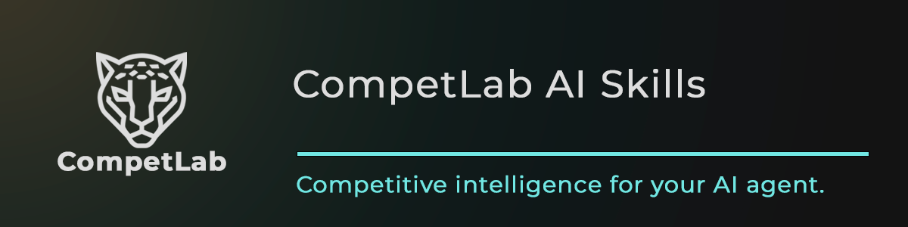

<p align="center">
  
</p>

# CompetLab Agent Skills

[](https://agentskills.io)
[](#the-skills)
[](https://opensource.org/licenses/MIT)
[](#cross-agent-compatibility)

> Competitive intelligence your agent can read — and read *correctly*.

CompetLab monitors your competitors across six dimensions and writes a Strategic Briefing over
fourteen analysis areas. These seven skills give an AI agent the vocabulary to read that data the way
the platform intends, and to shape it into the thing you actually need — a pulse, a dossier, a
battlecard, a work list.

**The skills do not do the research.** The platform does, with more sources and a memory of prior
readings. The skills make sure what comes out the other end is true.

## Install

```bash
git clone https://github.com/competlab/competlab-ci-skills.git
mkdir -p .claude/skills
cp -r competlab-ci-skills/skills/. .claude/skills/
```

Or, in Claude Code:

```
/plugin marketplace add competlab/competlab-ci-skills
/plugin install competlab-ci-skills@competlab-ci-skills
```

Or with the [`skills` CLI](https://github.com/vercel-labs/skills):

```bash
npx skills add competlab/competlab-ci-skills --all          # everything
npx skills add competlab/competlab-ci-skills --skill competlab-ai-visibility   # one
npx skills add competlab/competlab-ci-skills --all -g       # all projects
```

All three work. Every skill carries what it needs inside its own folder, so nothing depends on which
path you chose.

Then connect the MCP server, below. Every skill needs it — `competlab-site-audit` is the one that
needs nothing else.

## Connect CompetLab

```bash
claude mcp add --transport http competlab https://mcp.competlab.com/mcp \
  --header "CL-API-Key: cl_live_your_key_here"
```

<details>
<summary>Other clients</summary>

```json
{
  "mcpServers": {
    "competlab": {
      "type": "http",
      "url": "https://mcp.competlab.com/mcp",
      "headers": { "CL-API-Key": "cl_live_your_key_here" }
    }
  }
}
```
</details>

Keys come from **app.competlab.com → Organization Settings → API Keys**. One key covers your whole
organization, and a read-only key is enough for everything here.
Setup guide: [competlab.com/developers/mcp](https://competlab.com/developers/mcp).

> [Start a free trial](https://app.competlab.com/register) — 14 days, no credit card. Your API key is
> available immediately.

## The skills

| Skill | What it answers | Say this |
|---|---|---|
| **[competlab-ai-visibility](skills/competlab-ai-visibility/)** | Which companies do AI models recommend in my category — and am I one of them? | *"Are we in the core?"* |
| **[competlab-ai-sources](skills/competlab-ai-sources/)** | Which pages do the engines read before answering, and who is named on them? | *"Why them and not us?"* |
| **[competlab-briefing](skills/competlab-briefing/)** | What changed, what it means, what to do — at pulse, landscape or dimension depth | *"Catch me up"* |
| **[competlab-competitor-dive](skills/competlab-competitor-dive/)** | Everything we know about one rival, across six dimensions | *"Deep dive on [competitor]"* |
| **[competlab-battlecard](skills/competlab-battlecard/)** | A 60-second sales reference for a live call | *"Battlecard vs [competitor]"* |
| **[competlab-site-audit](skills/competlab-site-audit/)** | What can a machine actually read on this site? **No project needed** | *"Audit example.com"* |
| **[competlab-monitoring-setup](skills/competlab-monitoring-setup/)** | Am I watching the right competitors and asking the right questions? | *"Is my monitoring set up right?"* |

### Try it on any domain

`competlab-site-audit` runs on any public domain — no project, no monitored competitors, nothing set
up. A free-trial key is enough. Crawler access, sitemap coverage, agent adoption, tech stack, trust
signals.

> *"Audit example.com for agent adoption"*

## What CompetLab monitors

| Dimension | What it tracks |
|---|---|
| **AI Visibility** | Which companies AI models recommend in your category, and where you sit among them |
| **AI Sources** | The pages Perplexity and Google AI Overviews read while answering your buyers' questions |
| **Positioning** | Homepage messaging — headline, value proposition, CTAs, audience, differentiator |
| **Pricing Intelligence** | Plans, billing models, free tiers, enterprise pricing |
| **Content Intelligence** | Sitemap analysis, categories, publishing activity, gaps |
| **Tech & Trust Profile** | Tech stack, security headers, trust signals, AI crawler access |

**AI Visibility is queried across five engines** — ChatGPT, Claude, Gemini, Perplexity and Google AI
Overviews. It answers one question: who is recommended in this category, and are you one of them.
Google AI Overviews names companies in prose and ranks nothing.

**AI Sources is its companion.** It opens up the next question — why them and not you — by showing
what the engines actually read. It does not hand you a checklist, because the factors differ by
category: uptime-monitoring leaders are weighed on distributed networks, pricing and reliability;
database tools on certifications and an entirely different set.

## The part that matters most

Every skill carries `references/reading-the-data.md`, which is the reporting discipline the platform
enforces on itself:

- **`null` means we did not measure it.** Never zero, never empty, never "no". A real `0` is a finding;
  a `null` is a gap in our reading, and the two must never share a sentence.
- **Counts, never rates.** "Named in 8 of 69 answers", not "12%". The question set is small by design
  and a share computed from it is false precision.
- **Per engine, never pooled.** The engines read different pages; a combined figure describes a list
  none of them produced.
- **Retrieved, never cited.** The engines do not disclose which pages they leaned on, so a citation
  count is a number that does not exist.
- **Ranges that overlap are not ordered.** Two brands whose confidence intervals overlap are tied, and
  a difference between two overlapping readings is two readings — not a movement.

An agent given competitive data will happily round, pool and rank it into something confident and
wrong. This is the file that stops it.

## Cross-agent compatibility

Built on the [Agent Skills](https://agentskills.io) standard — plain `SKILL.md` files that work with
Claude Code, Cursor, Codex, Gemini CLI and any agent that reads the format. Tool names are written as
Claude Code's `mcp__competlab__*`; other clients may need them adjusted to their own convention.

## Contributing

See [CONTRIBUTING.md](CONTRIBUTING.md). CI checks that every skill's `allowed-tools` matches the tools
its body invokes, that every referenced file exists, and that the facts about the product have not gone
stale. Run it locally:

```bash
npm run check
```

## License

MIT — see [LICENSE](LICENSE).

---

<p align="center">
  <a href="https://competlab.com">CompetLab</a> ·
  <a href="https://competlab.com/developers/mcp">MCP</a> ·
  <a href="https://competlab.com/developers/api">API</a> ·
  <a href="https://competlab.com/developers/sdk">SDK</a>
</p>
